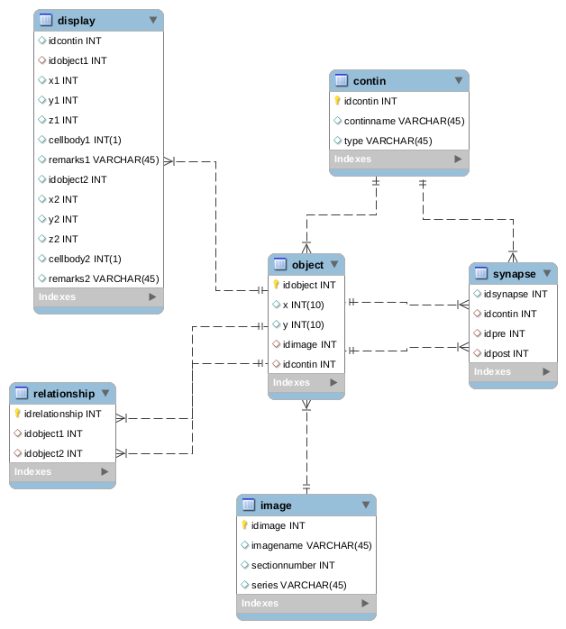

# wormwiring - Database schema

## image
Stores the image data

#### fields:
* idimage : index number
* imagename : name of image file without extension
* sectionnumber : Section number along the anterior-posterior axis
* series : image group label

### object
Every cell centroid and synapse in every EM section is stored as an object. 

#### fields:
* idobject: object index
* x : x coordinate
* y : y coordinate
* idimage : corresponding image index
* idcontin : corresponding contin index

## contin
Groups of linked objects are called contins. Objects are linked if they are in the same cell/syanpse across subsequent EM sections. 

#### fields:
* idcontin : contin index
* continname : Name of cell or synapse
* type : type of contin ('neuron','chemical','electrical')

## relationship
Relation ships are links between objects.

* idrelationship : relationship index
* idobject1 : object index
* idobject2 : object index

## synapse
Stores synapse data.

#### fields:
* idsynapse : synapse object index
* idcontin : contin index
* idpre : object index of presynaptic object
* idpost : object index postsynaptic object

## display
Contains spatial coordiinates of objects after any type of smoothing or filtering. 

#### fields:
* idcontin : contin index
* idobject1 : object1 index 
* x1 : x coordinate of object1
* y1 : y coordinate of object1
* z1 : z coordinate of object1
* cellbody1 : boolean if the object1 is a cellbody
* remarks1 : any remarks concerning the object1
* idobject2 : object2 index 
* x2 : x coordinate of object2
* y2 : y coordinate of object2
* z2 : z coordinate of object2
* cellbody2 : boolean if the object2 is a cellbody
* remarks2 : any remarks concerning the object2
